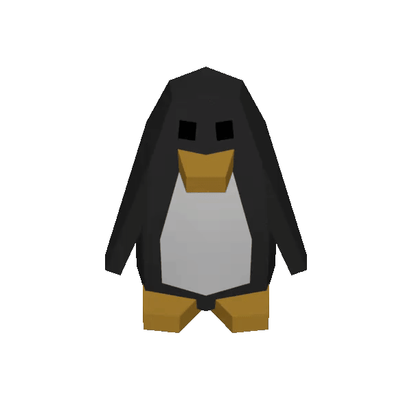

<br />

<div align="center">
    
    <div align="center">
        <p>
            turrel is a free and open source <a href="discord.gg">Discord</a> bot 
        </p>
        <p>
            It provides several features such as:
            Economy & Leveling
        </p>
        <p>
            <a href="https://discord.com/api/oauth2/authorize?client_id=1054601338312466505&permissions=8&scope=bot%20applications.commands">Invite to your server</a> - <a href="https://discord.gg/q2QJaBABwP">Support Server</a>
        </p>
    </div>
</div>

<details>
    <summary>
        Table of Contents
    </summary>
    <ol>
        <li>
            <a href="#installation">Installation</a>
        </li>
        <li>
            <a href="#usage">General Usage</a>
        </li>
        <li>
            <a href="#documentaion">Documentation</a>
        </li>
    </ol>
</details>

----------

<!-- What's needed to host the bot -->
### Prerequisites
A general understanding of Typescript, and Node/NPM.

For contributing it is expected that you understand the source code
behind the bot, and the general layout of the source code within.

<!-- how to install the lib... -->
### Installation

To begin, clone the repo
```sh
git clone https://github.com/turel-bot/bot.git
```

Then, move to the bot directory.
```sh
cd bot
```

From there, run the setup script.
```sh
npm run setup
# OR
# node ./scripts/setup.js
```

Lastly edit the `.env` file and fill in your information. You are expected to know how to get your
token and client id.

### Acknowledgements

This section is here to give acknowledgement to anyone who contributes, or takes the time to
report any issues within the source code; any efforts are heavily appreciated. Thank you all
for your time, and thank you anybody who uses this. 

### Licencing

This project is licenced using the MIT licence, you can find it
at [the LICENCE file](LICENCE)